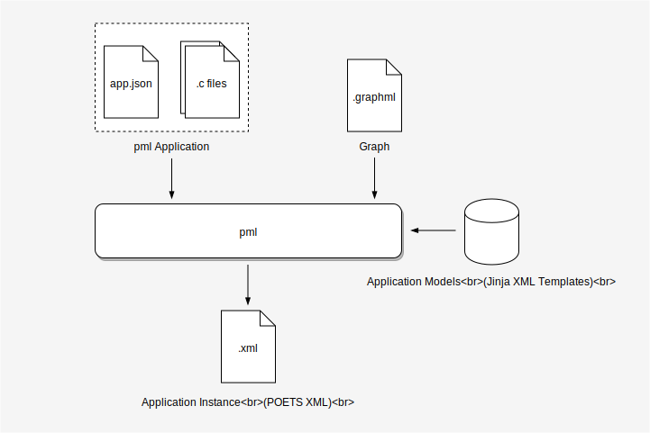

## POETS XML Generator (PML)

### Content

- [Overview](#overview)
- [Application Definition](#application-definition)
- [Features](#features)
- [Installation](#installation)
- [Documentation](#documentation)

### Overview

This repository contains a tool (`pml`) for generating POETS XML files from
higher-level descriptions.



#### Usage

```
Usage:
  pml.py <app.json> <file.graphml>
```

where `app.json` is an _application configuration file_ and `file.graphml` is
a graph in GraphML format.

### Application Definition

The application configuration file (called `app.json` by convention) is a
concise description of the application, specifying things such as
message/state fields and documentation strings. An example is shown below:


```json
{
    "type": "ro",
    "model": "simple",
    "doc": "Ring Oscillator",
    "messages": {
        "toggle": {
            "doc": "Toggle next node"
        }
    },
    "device": {
        "name": "node",
        "state": {
            "counter": {},
            "state": {}
        }
    }
}
```

This format is similar to the POETS XML schema but has three important
differences:

- **It does not contain device instance or connectivity information (the
problem graph)**. Graph instances are not considered part of `pml` application
logic -- they are treated as a seperate input to the code generation process.
This decoupling allows the same application to be combined with graphs of
different sizes and topologies.

- **It does not contain handler code snippets**. These are stored in separate
`.c` files, so that they are more convenient to edit, and are included
automatically during code generation.

- In general, the format follows [convention over
configuration](https://en.m.wikipedia.org/wiki/Convention_over_configuration).
For example, undeclared types are assumed `uint32_t` and handler code files
must be placed in the same directory as the configuration file.

### Features

#### Choice of Programming Model

In the above application file, the `"model": "simple"` entry defines this
application as an instance of the `simple` model. `pml` supports different
code generation models that provide slightly different programming interfaces.
For example, `simple` applications contain a single device type that can send
and receive all message types. The `simple` model makes it easier to develop
these applications without having to worry about device types, pins or edges,
all irrelevant details in this case.

`pml` does not only abstract away capabilities. Some models emulate behavior
that is not directly supported by hardware (or the POETS XML schema) but is
useful or convenient in some applications. For example, `simple` allows
receive handlers to queue messages for delivery (using software buffers).

#### Templating and Introspection

`pml` model templates are in fact [Jinja2](http://jinja.pocoo.org/) template
XML files, inheriting all the capabilities of Jinja. Application handler files
are imported as Jinja templates too, and are passed graph and application
information through Jinja's
[context](http://jinja.pocoo.org/docs/2.10/api/#the-context) giving them
poweful templating and introspective features.

To illustrate why this may be useful, consider the following snippet:

```c
// File: print_msg.c

handler_log(2, "Content of %d message:", {{ msg_type }})



handler_log(2, "Field {{ field }} = %d", msg->{{ field }});

```

The above template can be re-used to dump the content of any message type, for
example as in:

```c
// File: receive_req.c

{{ include('print_msg.c', msg_type='req') }}
```

This is possible because the context of `print_msg.c` has access to the
application's configuration (the `messages` dictionary in this case) so it can
enumerate message fields during code generation. Graph information can be
accessed in a similar way too, offering a convenient alternative to
maintaining XML properties.

### Installation

Requirements: Python 2 and `pip`.

To install using `pip`, run:

```bash
git clone https://github.com/POETSII/pml.git
pip install -r requirements.txt
```

or with `pip` and `virtualenv`:

```bash
git clone https://github.com/POETSII/pml.git
virtualenv env
source env/bin/activate
pip install -r requirements.txt
```

### Documentation

- [User's Manual](doc/manual.md)
- [Developer's Guide](doc/develop.md)
