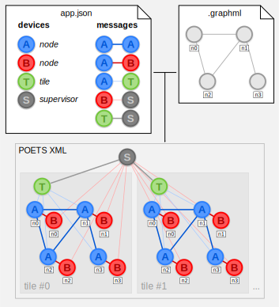

# Tiles Template

The template is designed for applications that work over multiple copies
of the same problem within a single XML in order to increase parallelisation.

> **Tile** is a single copy of the source graph (graphml).

The number of tiles is passed as a parameter to the generator, default is 1.

Additionally, the template supports multiple device types and supervisor devices.

## Instantiation and topology

### Device 'instance' property

The `devices` dictionary defines the set of device types where the keys are device type names.
For instance, the following code defines device types `A`, `B`, `T`, and `S`.

```json
"devices": {
	"A": { "instance": "node" },
	"B": { "instance": "node" },
	"T": { "instance": "tile" },
	"S": { "instance": "supervisor" }
}
```

The `instance` property of the device type specifies how it is instantiated
in relation to the source graph and tiles. The property can take one of the following values:

- **node** - the device is instantiated for each node in the graph in each tile.
- **tile** - the device is instantiated once per tile (tile-unique); this may be used to create local psuedo-supervisors
	that commutnicate with the nodes of one tile.
- **unique** - only one instance of the device is created (singleton).
- **supervisor** - same as `unique`, but creates `SupervisorDeviceType`
	that runs on the mothership instead of tinsel.

### Message sources and destinations

The `messages` dictionary defines the set of message types where the keys are message type names.

```json
"messages": {
	"AA": { "src": ["A"], "dst": ["A"] },
	"AB": { "src": ["A"], "dst": ["B"] },
	"AT": { "src": ["A"], "dst": ["T"] },
	"BS": { "src": ["B"], "dst": ["S"] },
	"TS": { "src": ["T"], "dst": ["S"] },
}
```

`src` is the list of device types that can send the message. Only devices in this list will have
an output port for this message type. Output port names have `_out` postfix following the
message type name.

`dst` is the list of device types that can receive the message. Only devices in this list will have
an input port for this message type. Input port names have `_in` postfix following the
message type name.

### Putting it together

Edges between device instances are generated depending on the device instantiation types
and message types.



- For **node-node** messages:
	- _If the source and destination device types are the same:_ create an edge for each edge in the graphml file
		(see AA messages in the example). These edges do not cross tile boundaries.
	- _If the source and destination device types differ:_ create an edge between device instances
		corresponding to the same node in the graphml (see AB messages in the example).
		These edges do not cross tile boundaries.
- For **node-tile** messages: connect each node in a graph tile to the respective tile-unique node.
- For **node-unique**, **node-supervisor**, **tile-unique**, or **tile-supervisor** messages:
	connect all instances to the unique node.
